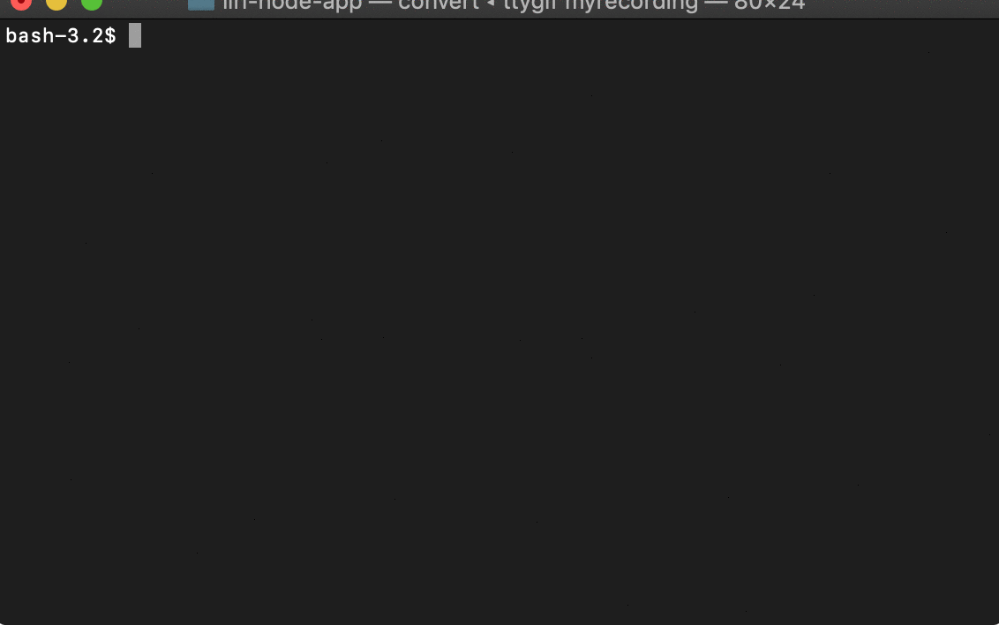

# LIRI Bot

### Overview

LIRI is like iPhone's SIRI. However, while SIRI is a Speech Interpretation and Recognition Interface, LIRI is a _Language_ Interpretation and Recognition Interface. LIRI will be a command line node app that takes in parameters and gives you back data.

### LIRI Bot Command Lists

* **concert-this** *(artist or band name here)* : Search the concert of event of this artist or band
* **spotify-this-song** *(song title here)* : Search and show information about this song
* **movie-this** *(movie title here)* : Search and show information about this movie
* **do-what-it-says** : Read 'random.txt' file, then do what it says!

### Preview

### Technology Used

* Javascript
* Node.js
* Node-Spotify-API
* AXIOS
* Moment
* FS (File System)
* DotEnv
* Spotify API
* SeatGeek API
